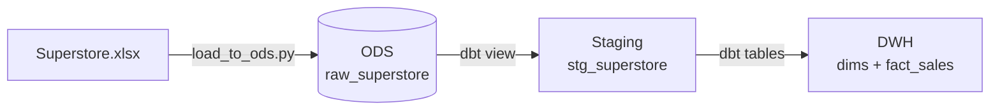
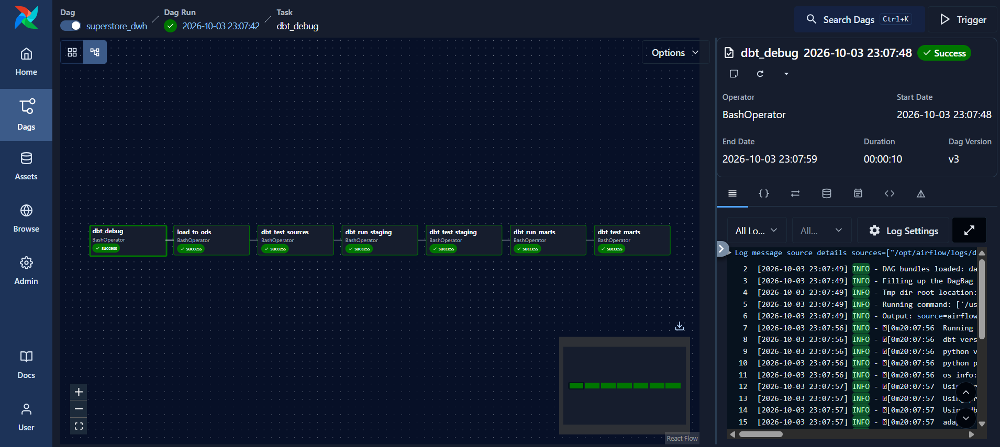
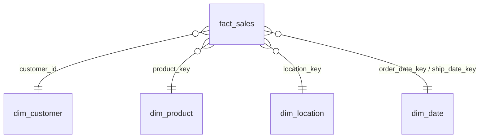

# 🏬 Superstore Data Warehouse — Airflow × dbt × DuckDB


An end-to-end **ELT pipeline** that turns a raw Excel file into a tested **star-schema data warehouse**.
**Airflow** orchestrates the run, **dbt** transforms and tests the data, and **DuckDB** stores it, all in a single local file.

---

## 🗺️ How It Works



| Layer | Schema | Objects | Role |
|---|---|---|---|
|  **ODS** | `ods` | `raw_superstore` | Untouched copy of the Excel sheet |
|  **Staging** | `main_stg` | `stg_superstore` | Trimmed, typed, postal codes fixed |
|  **Warehouse** | `main_dwh` | `dim_customer` · `dim_product` · `dim_location` · `dim_date` · `fact_sales` | Star schema, one fact row per order line |

---

## 🚀 Quick Start

> **Prerequisites:** Docker Desktop running, and nothing else holding `dbt_project/dev.duckdb` open (DBeaver, DuckDB CLI…). DuckDB allows only one writer at a time.

```powershell
cd airflow
docker compose build      # first time only, takes a few minutes
docker compose up -d      # start Airflow in the background
```

1. Open **http://localhost:8080** (no login, local dev setup)
2. Find the **`superstore_dwh`** DAG and **unpause** it with the toggle
3. Click **▶ Trigger** and watch the tasks turn 🟩 in the **Grid** view

| Command | Purpose |
|---|---|
| `docker compose logs -f` | Follow Airflow logs |
| `docker compose stop` | Stop Airflow (keeps the container) |
| `docker compose down` | Remove the container (your project files are untouched) |
| `docker exec -it superstore-airflow airflow dags test superstore_dwh` | Run the whole DAG once from the CLI |

---

## ⚙️ The DAG: `superstore_dwh`

Scheduled **`@daily`** · retries **1×** after 2 min · each task runs only if the previous one succeeded.

```
dbt_debug ─► load_to_ods ─► dbt_test_sources ─► dbt_run_staging ─► dbt_test_staging ─► dbt_run_marts ─► dbt_test_marts
```

Every layer is **built, then tested right away**, so a red task tells you exactly which layer broke, and a broken layer never feeds the next one.

| # | Task | Command | What it does |
|:-:|---|---|---|
| 1 | `dbt_debug` | `dbt debug` | Checks dbt's config and its connection to DuckDB, fails fast before anything changes |
| 2 | `load_to_ods` | `python scripts/load_to_ods.py` | Loads `Superstore.xlsx` into `ods.raw_superstore` (9,994 rows) |
| 3 | `dbt_test_sources` | `dbt test --select source:ods` | **5 tests** on the raw data: `row_id` unique, keys not null |
| 4 | `dbt_run_staging` | `dbt run --select staging` | Builds the `stg_superstore` view |
| 5 | `dbt_test_staging` | `dbt test --select staging --exclude source:ods` | **14 tests** on the cleaned data: keys not null, allowed values |
| 6 | `dbt_run_marts` | `dbt run --select marts` | Builds the 4 dimensions, then `fact_sales` |
| 7 | `dbt_test_marts` | `dbt test --select marts` | **22 tests**: dimension keys, fact → dim relationships and the **ODS ↔ DWH reconciliation** |




---

## ✅ Data Quality Tests

**41 tests** guard the pipeline, run in three checkpoints, one after each layer. The full list, test by test, is in [docs/DATA_QUALITY.md](docs/DATA_QUALITY.md).

| Checkpoint | Model | `unique` | `not_null` | `accepted_values` | `relationships` | Custom | Total |
|---|---|:-:|:-:|:-:|:-:|:-:|:-:|
| `dbt_test_sources` | `ods.raw_superstore` | 1 | 4 | – | – | – | **5** |
| `dbt_test_staging` | `stg_superstore` | 1 | 9 | 4 | – | – | **14** |
| `dbt_test_marts` | `dim_customer` | 1 | 1 | – | – | – | 2 |
| | `dim_product` | 1 | 2 | – | – | – | 3 |
| | `dim_location` | 1 | 1 | – | – | – | 2 |
| | `dim_date` | 1 | 1 | – | – | – | 2 |
| | `fact_sales` | 1 | 6 | – | 5 | 1 | 13 |
| | | | | | | | **41** |

What each kind of test proves:

- **`unique` / `not_null`**: every table keeps its grain, no duplicated or missing keys
- **`accepted_values`**: `ship_mode`, `segment`, `region` and `category` only hold known values
- **`relationships`**: every `fact_sales` row points to an existing customer, product, location, order date and ship date
- **`assert_fact_sales_reconciles_with_ods`** (custom, [tests/](dbt_project/tests/assert_fact_sales_reconciles_with_ods.sql)): row count, total `sales` and total `profit` in `fact_sales` match the ODS within 0.01, so nothing was lost or duplicated on the way

### Test results

**1. Sources**, after `load_to_ods`


**2. Staging**, after `dbt_run_staging`


**3. Marts**, after `dbt_run_marts`


---

##  Warehouse Model



| Table | Grain | Rows |
|---|---|--:|
| `fact_sales` | One order line | 9,994 |
| `dim_customer` | One customer | 793 |
| `dim_product` | One `product_id` + `product_name` *(IDs are reused in the source)* | 1,894 |
| `dim_location` | One postal code + city + state *(a postal code can span two cities)* | 632 |
| `dim_date` | One calendar day, 2014–2018 | 1,826 |

---

## 📁 Project Structure

```
Dbt_project/
├── airflow/
│   ├── dags/superstore_dwh_dag.py   # the pipeline definition
│   ├── Dockerfile                   # Airflow image + dbt in its own virtualenv
│   ├── docker-compose.yaml          # mounts this whole folder into the container
│   └── requirements-dbt.txt         # pinned dbt / DuckDB versions
├── data/raw/Superstore.xlsx         # source data
├── docs/                            # data quality test catalogue + screenshots
├── scripts/load_to_ods.py           # Excel → ODS loader
└── dbt_project/
    ├── models/staging/              # sources + stg_superstore
    ├── models/marts/                # dimensions + fact_sales
    ├── tests/                       # reconciliation test
    ├── profiles.yml                 # DuckDB connection used by Airflow
    └── dev.duckdb                   # the warehouse itself
```

---

##  Run It Without Airflow

Useful while developing models. Run these from `dbt_project/` with **dbt-core** (`dbt --version` should show `Core: 1.12.x`):

```powershell
python ..\scripts\load_to_ods.py     # → Loaded ods.raw_superstore: 9994 rows
dbt build --profiles-dir .           # → PASS=47 WARN=0 ERROR=0 (6 models + 41 tests)

# or layer by layer, like the DAG does
dbt test --select source:ods --indirect-selection cautious --profiles-dir .   # PASS=5
dbt run  --select staging --profiles-dir .
dbt test --select staging --exclude source:ods --profiles-dir .              # PASS=14
dbt run  --select marts --profiles-dir .
dbt test --select marts --profiles-dir .                                     # PASS=22
dbt docs generate --profiles-dir .
dbt docs serve --profiles-dir . --port 8081   # lineage graph (8080 is Airflow)
```

---

## 🛠️ Troubleshooting

| Symptom | Fix |
|---|---|
| `Could not set lock on file ... dev.duckdb` | Close any app using the database, then clear the failed task to re-run it |
| `KeyError: 'dbt_duckdb://macros/catalog.sql'` | dbt's parse cache was written by dbt on the host. The DAG already passes `--no-partial-parse`; for manual runs in the container add it too, or delete `dbt_project/target/partial_parse.msgpack` |
| DAG missing from the UI | `docker exec -it superstore-airflow airflow dags list-import-errors` |
| Port 8080 already in use | Change the port mapping to `"8090:8080"` in `docker-compose.yaml` |
