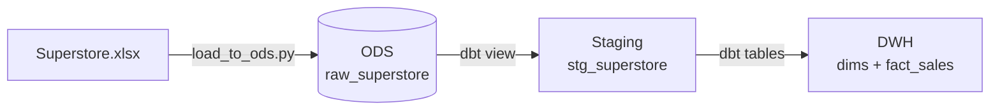
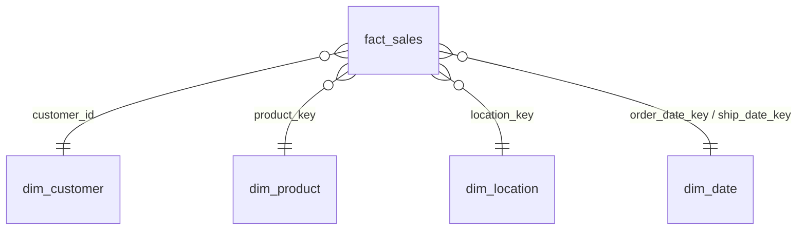

# 🏬 Superstore Data Warehouse — Airflow × dbt × DuckDB


An end-to-end **ELT pipeline** that turns a raw Excel file into a tested **star-schema data warehouse**.
**Airflow** orchestrates the run, **dbt** transforms and tests the data, and **DuckDB** stores it, all in a single local file.

---

## 🗺️ How It Works



| Layer | Schema | Objects | Role |
|---|---|---|---|
|  **ODS** | `ods` | `raw_superstore` | Untouched copy of the Excel sheet |
|  **Staging** | `main_stg` | `stg_superstore` | Trimmed, typed, postal codes fixed |
|  **Warehouse** | `main_dwh` | `dim_customer` · `dim_product` · `dim_location` · `dim_date` · `fact_sales` | Star schema, one fact row per order line |

---

## 🚀 Quick Start

> **Prerequisites:** Docker Desktop running, and nothing else holding `dbt_project/dev.duckdb` open (DBeaver, DuckDB CLI…). DuckDB allows only one writer at a time.

```powershell
cd airflow
docker compose build      # first time only, takes a few minutes
docker compose up -d      # start Airflow in the background
```

1. Open **http://localhost:8080** (no login, local dev setup)
2. Find the **`superstore_dwh`** DAG and **unpause** it with the toggle
3. Click **▶ Trigger** and watch the tasks turn 🟩 in the **Grid** view

| Command | Purpose |
|---|---|
| `docker compose logs -f` | Follow Airflow logs |
| `docker compose stop` | Stop Airflow (keeps the container) |
| `docker compose down` | Remove the container (your project files are untouched) |
| `docker exec -it superstore-airflow airflow dags test superstore_dwh` | Run the whole DAG once from the CLI |

---

## ⚙️ The DAG: `superstore_dwh`

Scheduled **`@daily`** · retries **1×** after 2 min · each task runs only if the previous one succeeded.

```
dbt_debug ──► load_to_ods ──► dbt_test_sources ──► dbt_run ──► dbt_test
```

| # | Task | What it does | Why it matters |
|:-:|---|---|---|
| 1 |  `dbt_debug` | Checks dbt's config and its connection to DuckDB | Fails fast before anything is changed |
| 2 |  `load_to_ods` | Loads `Superstore.xlsx` into `ods.raw_superstore` (9,994 rows) | Brings fresh source data in |
| 3 |  `dbt_test_sources` | Tests the raw data: `row_id` unique, keys not null | Bad data never reaches the warehouse |
| 4 |  `dbt_run` | Builds `stg_superstore`, then the 4 dimensions, then `fact_sales` | Rebuilds the warehouse |
| 5 |  `dbt_test` | Runs all data tests, including the **ODS ↔ DWH reconciliation** | Proves no rows or amounts were lost |

---

##  Warehouse Model



| Table | Grain | Rows |
|---|---|--:|
| `fact_sales` | One order line | 9,994 |
| `dim_customer` | One customer | 793 |
| `dim_product` | One `product_id` + `product_name` *(IDs are reused in the source)* | 1,894 |
| `dim_location` | One postal code + city + state *(a postal code can span two cities)* | 632 |
| `dim_date` | One calendar day, 2014–2018 | 1,826 |

---

## 📁 Project Structure

```
Dbt_project/
├── airflow/
│   ├── dags/superstore_dwh_dag.py   # the pipeline definition
│   ├── Dockerfile                   # Airflow image + dbt in its own virtualenv
│   ├── docker-compose.yaml          # mounts this whole folder into the container
│   └── requirements-dbt.txt         # pinned dbt / DuckDB versions
├── data/raw/Superstore.xlsx         # source data
├── scripts/load_to_ods.py           # Excel → ODS loader
└── dbt_project/
    ├── models/staging/              # sources + stg_superstore
    ├── models/marts/                # dimensions + fact_sales
    ├── tests/                       # reconciliation test
    ├── profiles.yml                 # DuckDB connection used by Airflow
    └── dev.duckdb                   # the warehouse itself
```

---

##  Run It Without Airflow

Useful while developing models. Run these from `dbt_project/` with **dbt-core** (`dbt --version` should show `Core: 1.12.x`):

```powershell
python ..\scripts\load_to_ods.py     # → Loaded ods.raw_superstore: 9994 rows
dbt build --profiles-dir .           # → PASS=47 WARN=0 ERROR=0
dbt docs generate --profiles-dir .
dbt docs serve --profiles-dir . --port 8081   # lineage graph (8080 is Airflow)
```

---

## 🛠️ Troubleshooting

| Symptom | Fix |
|---|---|
| `Could not set lock on file ... dev.duckdb` | Close any app using the database, then clear the failed task to re-run it |
| DAG missing from the UI | `docker exec -it superstore-airflow airflow dags list-import-errors` |
| Port 8080 already in use | Change the port mapping to `"8090:8080"` in `docker-compose.yaml` |
