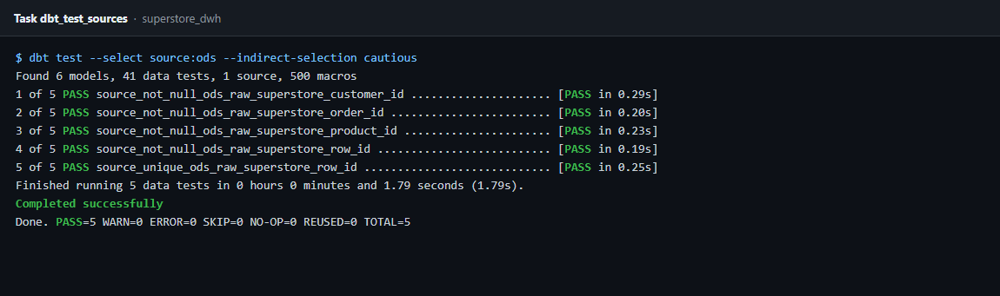
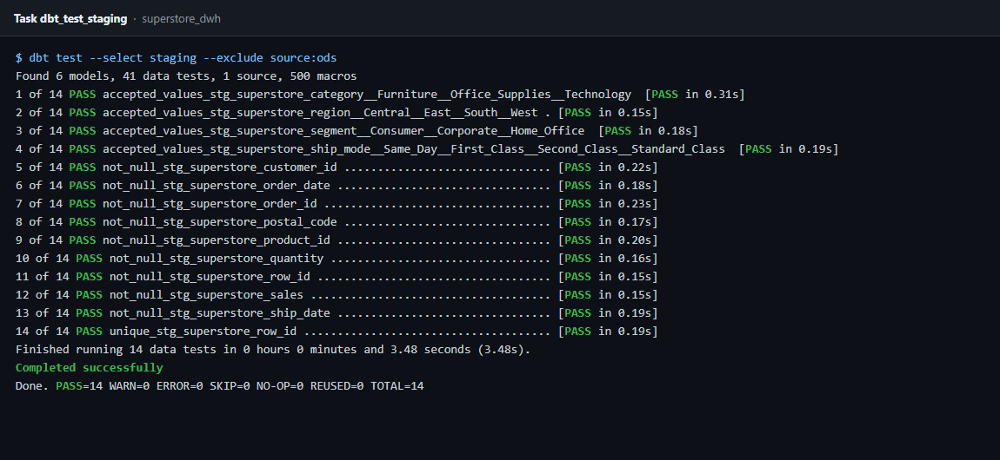
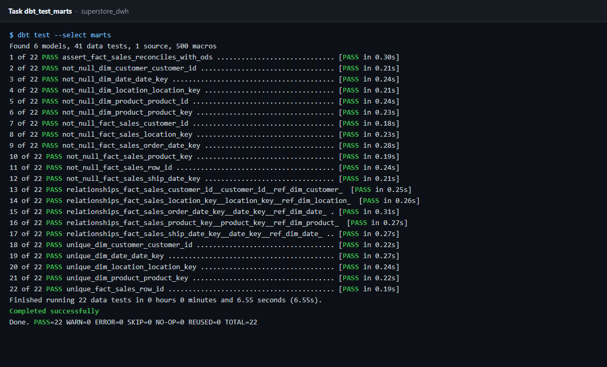
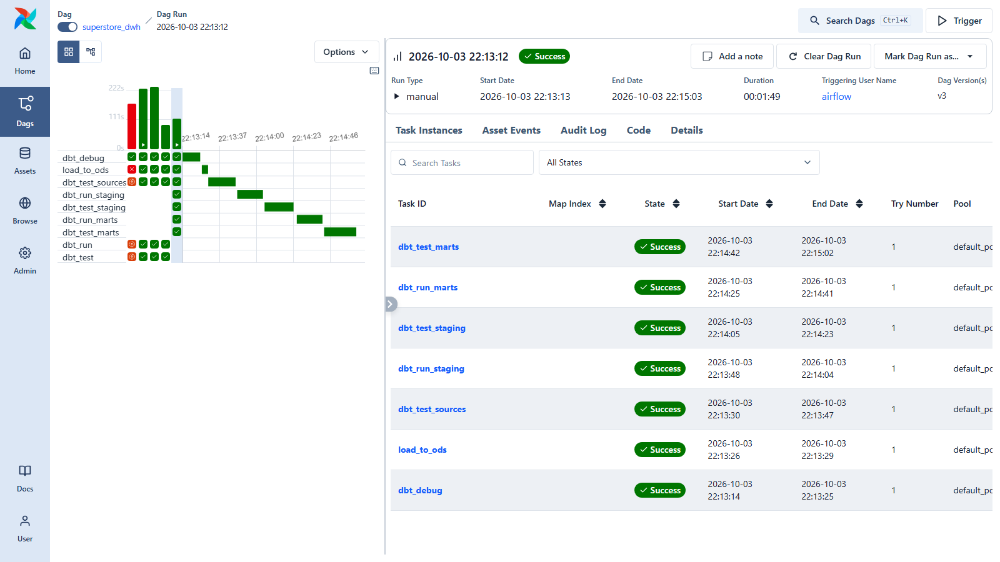

# ✅ Data Quality Tests

The `superstore_dwh` DAG runs **41 dbt tests** in three checkpoints. Each checkpoint runs right after the layer it checks is built, so a failure points to one layer, and that layer never feeds the next one.

```
load_to_ods ─► dbt_test_sources ─► dbt_run_staging ─► dbt_test_staging ─► dbt_run_marts ─► dbt_test_marts
                  (5 tests)                              (14 tests)                           (22 tests)
```

Tests are declared in:

- [models/staging/sources.yml](../dbt_project/models/staging/sources.yml): source tests
- [models/staging/schema.yml](../dbt_project/models/staging/schema.yml): staging tests
- [models/marts/schema.yml](../dbt_project/models/marts/schema.yml): dimension and fact tests
- [tests/assert_fact_sales_reconciles_with_ods.sql](../dbt_project/tests/assert_fact_sales_reconciles_with_ods.sql): custom reconciliation test

---

## 1. Sources: `dbt_test_sources` (5 tests)

Runs on `ods.raw_superstore` right after the Excel load, so bad raw data stops the pipeline before any model is built.

```bash
dbt test --select source:ods --indirect-selection cautious
```

| # | Test | Column | Checks |
|:-:|---|---|---|
| 1 | `source_unique_ods_raw_superstore_row_id` | `row_id` | No duplicated order lines |
| 2 | `source_not_null_ods_raw_superstore_row_id` | `row_id` | Every line has an ID |
| 3 | `source_not_null_ods_raw_superstore_order_id` | `order_id` | Every line belongs to an order |
| 4 | `source_not_null_ods_raw_superstore_customer_id` | `customer_id` | Every line has a customer |
| 5 | `source_not_null_ods_raw_superstore_product_id` | `product_id` | Every line has a product |



---

## 2. Staging: `dbt_test_staging` (14 tests)

Runs on `stg_superstore` after cleaning and typing. `--exclude source:ods` skips the source tests, which also live under `models/staging/` and already ran.

```bash
dbt test --select staging --exclude source:ods
```

| # | Test | Column | Checks |
|:-:|---|---|---|
| 1 | `unique` | `row_id` | Grain is still one row per order line |
| 2 | `not_null` | `row_id` | |
| 3 | `not_null` | `order_id` | |
| 4 | `not_null` | `order_date` | Date parsing did not fail |
| 5 | `not_null` | `ship_date` | Date parsing did not fail |
| 6 | `not_null` | `customer_id` | |
| 7 | `not_null` | `postal_code` | Postal code fix left no gaps |
| 8 | `not_null` | `product_id` | |
| 9 | `not_null` | `sales` | Amount casting did not fail |
| 10 | `not_null` | `quantity` | Amount casting did not fail |
| 11 | `accepted_values` | `ship_mode` | `Same Day`, `First Class`, `Second Class`, `Standard Class` |
| 12 | `accepted_values` | `segment` | `Consumer`, `Corporate`, `Home Office` |
| 13 | `accepted_values` | `region` | `Central`, `East`, `South`, `West` |
| 14 | `accepted_values` | `category` | `Furniture`, `Office Supplies`, `Technology` |



---

## 3. Marts: `dbt_test_marts` (22 tests)

Runs on the star schema in `main_dwh`. It also picks up the custom reconciliation test, because that test depends on `fact_sales`.

```bash
dbt test --select marts
```

### Dimensions (9 tests)

| # | Model | Column | Tests | Checks |
|:-:|---|---|---|---|
| 1–2 | `dim_customer` | `customer_id` | `unique`, `not_null` | One row per customer |
| 3–4 | `dim_product` | `product_key` | `unique`, `not_null` | One row per (`product_id`, `product_name`) |
| 5 | `dim_product` | `product_id` | `not_null` | |
| 6–7 | `dim_location` | `location_key` | `unique`, `not_null` | One row per (postal code, city, state) |
| 8–9 | `dim_date` | `date_key` | `unique`, `not_null` | One row per calendar day |

### Fact (12 tests)

| # | Column | Tests | Checks |
|:-:|---|---|---|
| 10–11 | `row_id` | `unique`, `not_null` | One row per order line |
| 12–13 | `customer_id` | `not_null`, `relationships` → `dim_customer.customer_id` | No orphan customers |
| 14–15 | `product_key` | `not_null`, `relationships` → `dim_product.product_key` | No orphan products |
| 16–17 | `location_key` | `not_null`, `relationships` → `dim_location.location_key` | No orphan locations |
| 18–19 | `order_date_key` | `not_null`, `relationships` → `dim_date.date_key` | Order date is in the calendar |
| 20–21 | `ship_date_key` | `not_null`, `relationships` → `dim_date.date_key` | Ship date is in the calendar |

### Reconciliation (1 custom test)

| # | Test | Checks |
|:-:|---|---|
| 22 | `assert_fact_sales_reconciles_with_ods` | `fact_sales` and `ods.raw_superstore` have the same row count, and total `sales` and `profit` match within 0.01 |

The test returns a row, and so fails, only when the numbers differ, which proves no line or amount was lost or duplicated between the raw load and the warehouse.



---

## Summary

| Checkpoint | Tests | Result |
|---|:-:|---|
| `dbt_test_sources` | 5 | PASS=5 |
| `dbt_test_staging` | 14 | PASS=14 |
| `dbt_test_marts` | 22 | PASS=22 |
| **Total** | **41** | **PASS=41 WARN=0 ERROR=0** |


